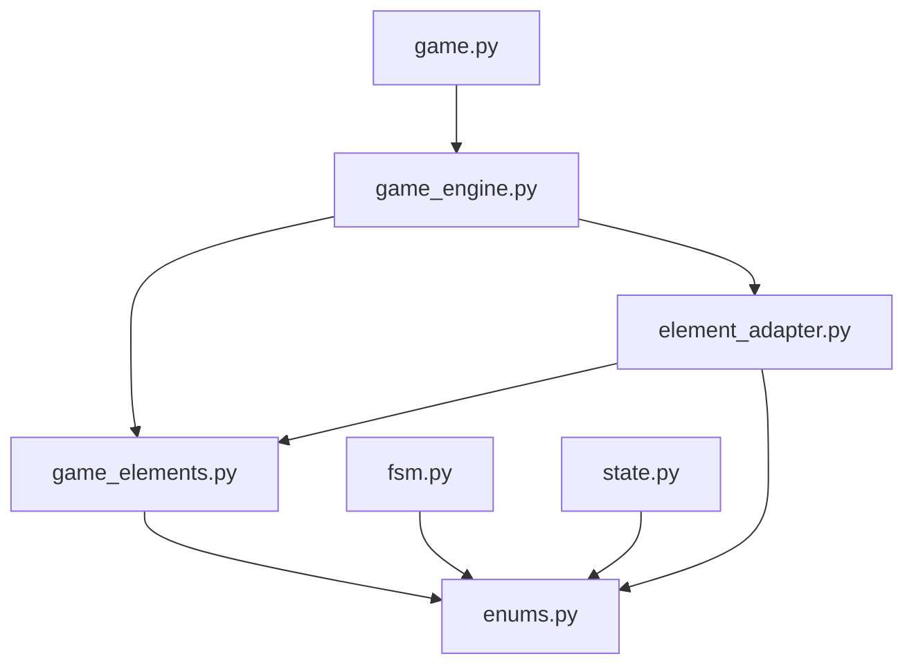

# 基础元素系统架构文档

## 目录
1. [系统概述](#1-系统概述)
2. [设计理念](#2-设计理念)
3. [模块结构](#3-模块结构)
4. [核心组件详解](#4-核心组件详解)
5. [元素类型定义](#5-元素类型定义)
6. [裁决引擎实现](#6-裁决引擎实现)
7. [适配器模式应用](#7-适配器模式应用)
8. [配置系统](#8-配置系统)
9. [扩展机制](#9-扩展机制)
10. [使用指南](#10-使用指南)
11. [最佳实践](#11-最佳实践)

---

## 1. 系统概述

### 1.1 项目背景

基础元素系统（Base Element System）是三国杀游戏引擎的核心架构组件，位于 `app/core/base` 模块。该系统通过将游戏中的复杂状态抽象为统一的元素接口，实现了游戏逻辑的模块化和可扩展性。

### 1.2 核心价值

- **统一性**：所有游戏状态通过统一的元素接口访问
- **灵活性**：支持复杂条件组合和动态规则配置
- **兼容性**：与现有游戏模型完全兼容，支持渐进式迁移
- **可维护性**：清晰的模块分离和配置化管理

### 1.3 技术特点

- 基于抽象工厂模式的元素创建
- 策略模式实现的条件检查
- 适配器模式的数据转换
- 配置驱动的技能定义

---

## 2. 设计理念

### 2.1 元素化抽象

将游戏中的所有状态归结为五个基础元素类型：

```
游戏状态
    ├── 卡牌元素 (CardElement)
    │   ├── 手牌管理
    │   ├── 牌堆状态
    │   └── 弃牌堆管理
    ├── 血量元素 (HealthElement)
    │   ├── 当前血量
    │   ├── 最大血量
    │   └── 生存状态
    ├── 势力元素 (FactionElement)
    │   ├── 势力归属
    │   ├── 势力关系
    │   └── 阵营判定
    ├── 装备元素 (EquipmentElement)
    │   ├── 武器装备
    │   ├── 防具装备
    │   └── 坐骑装备
    └── 距离元素 (DistanceElement)
        ├── 座位距离
        ├── 攻击范围
        └── 距离修正
```

### 2.2 技能作为元素组合

技能不再是独立的判定要素，而是基础元素的组合运用：

```python
# 技能定义示例
skill_config = {
    "奸雄": {
        "trigger_conditions": [
            {"element": "health", "condition": "damage_taken", "value": True}
        ],
        "effect_conditions": [
            {"element": "card", "condition": "can_gain_card", "source": "damage_card"}
        ],
        "effects": [
            {"element": "card", "action": "gain_card", "source": "damage_card"}
        ]
    }
}
```

### 2.3 统一的裁决流程

所有游戏判定都遵循统一的流程：

```
输入请求 → 元素转换 → 条件检查 → 效果执行 → 结果返回
    ↓         ↓         ↓         ↓         ↓
  游戏动作   元素状态   规则验证   状态修改   执行结果
```

---

## 3. 模块结构

### 3.1 文件组织

```
app/core/base/
├── __init__.py                 # 模块导出接口
├── enums.py                   # 枚举定义
├── game_elements.py           # 基础元素系统核心
├── element_adapter.py         # 玩家适配器
├── fsm.py                     # 状态机支持
├── game.py                    # 游戏核心逻辑
├── game_engine.py             # 游戏引擎
├── path_utils.py              # 路径工具
└── state.py                   # 状态管理
```

### 3.2 依赖关系



### 3.3 导入接口

```python
# 统一导入接口
from app.core.base import (
    # 核心引擎
    ElementBasedAdjudicationEngine,
    
    # 基础元素
    BaseElement, CardElement, HealthElement, 
    FactionElement, EquipmentElement, DistanceElement,
    
    # 适配器
    ElementPlayerAdapter,
    
    # 枚举
    ElementType, ElementState, Faction,
    
    # 工具
    PathUtils
)
```

---

## 4. 核心组件详解

### 4.1 BaseElement（基础元素基类）

#### 4.1.1 类定义

```python
class BaseElement:
    """基础元素基类，定义统一的元素接口"""
    
    def __init__(self, element_type: ElementType, state: ElementState):
        self.element_type = element_type
        self.state = state
        self.conditions = {}
        self.effects = {}
    
    def check_condition(self, condition_name: str, **kwargs) -> bool:
        """检查元素条件"""
        if condition_name in self.conditions:
            return self.conditions[condition_name](**kwargs)
        return False
    
    def apply_effect(self, effect_name: str, **kwargs) -> Dict[str, Any]:
        """应用元素效果"""
        if effect_name in self.effects:
            return self.effects[effect_name](**kwargs)
        return {"success": False, "message": f"Unknown effect: {effect_name}"}
    
    def get_state_value(self, key: str) -> Any:
        """获取状态值"""
        return getattr(self.state, key, None)
    
    def set_state_value(self, key: str, value: Any) -> None:
        """设置状态值"""
        setattr(self.state, key, value)
```

#### 4.1.2 设计模式

- **模板方法模式**：定义统一的条件检查和效果应用流程
- **策略模式**：通过条件和效果字典实现不同策略
- **状态模式**：通过 ElementState 管理元素状态

### 4.2 ElementBasedAdjudicationEngine（裁决引擎）

#### 4.2.1 核心功能

```python
class ElementBasedAdjudicationEngine:
    """基于基础元素的裁决引擎"""
    
    def __init__(self):
        self.skill_configs = self._load_skill_configs()
        self.condition_handlers = self._init_condition_handlers()
        self.effect_handlers = self._init_effect_handlers()
    
    def check_condition(self, condition_name: str, 
                       player_elements: Dict[str, BaseElement], 
                       **kwargs) -> bool:
        """统一的条件检查接口"""
        # 解析条件名称，确定元素类型
        element_type, condition = self._parse_condition_name(condition_name)
        
        # 获取对应元素
        if element_type not in player_elements:
            return False
        
        element = player_elements[element_type]
        
        # 执行条件检查
        return element.check_condition(condition, **kwargs)
    
    def adjudicate_skill_use(self, skill_name: str, 
                           player_elements: Dict[str, BaseElement], 
                           context: Dict[str, Any]) -> Dict[str, Any]:
        """裁决技能使用"""
        # 获取技能配置
        if skill_name not in self.skill_configs:
            return {
                "success": False,
                "message": f"未找到技能配置: {skill_name}"
            }
        
        skill_config = self.skill_configs[skill_name]
        
        # 检查触发条件
        if not self._check_trigger_conditions(skill_config, player_elements, context):
            return {
                "success": False,
                "message": f"技能 {skill_name} 触发条件不满足"
            }
        
        # 检查效果条件
        if not self._check_effect_conditions(skill_config, player_elements, context):
            return {
                "success": False,
                "message": f"技能 {skill_name} 效果条件不满足"
            }
        
        # 执行技能效果
        effects_result = self._execute_skill_effects(skill_config, player_elements, context)
        
        return {
            "success": True,
            "message": f"技能 {skill_name} 执行成功",
            "effects": effects_result
        }
```

#### 4.2.2 条件检查机制

```python
def _check_trigger_conditions(self, skill_config: Dict, 
                            player_elements: Dict[str, BaseElement], 
                            context: Dict[str, Any]) -> bool:
    """检查技能触发条件"""
    trigger_conditions = skill_config.get("trigger_conditions", [])
    
    for condition in trigger_conditions:
        element_type = condition["element"]
        condition_name = condition["condition"]
        condition_value = condition.get("value")
        
        # 获取元素
        if element_type not in player_elements:
            return False
        
        element = player_elements[element_type]
        
        # 检查条件
        if not element.check_condition(condition_name, 
                                     value=condition_value, 
                                     context=context):
            return False
    
    return True
```

### 4.3 ElementPlayerAdapter（适配器）

#### 4.3.1 适配器模式实现

```python
class ElementPlayerAdapter:
    """将Player对象转换为元素系统"""
    
    def __init__(self):
        self.element_factories = {
            ElementType.CARD: self._create_card_element,
            ElementType.HEALTH: self._create_health_element,
            ElementType.FACTION: self._create_faction_element,
            ElementType.EQUIPMENT: self._create_equipment_element,
            ElementType.DISTANCE: self._create_distance_element
        }
    
    def convert_player_to_elements(self, player: Player, 
                                 all_players: List[Player]) -> Dict[str, BaseElement]:
        """转换玩家为元素字典"""
        elements = {}
        
        for element_type in ElementType:
            if element_type in self.element_factories:
                factory = self.element_factories[element_type]
                elements[element_type.value] = factory(player, all_players)
        
        return elements
    
    def _create_card_element(self, player: Player, all_players: List[Player]) -> CardElement:
        """创建卡牌元素"""
        state = CardElementState(
            hand_cards=player.hand_cards,
            hand_card_count=len(player.hand_cards),
            max_hand_cards=player.max_hand_cards
        )
        return CardElement(ElementType.CARD, state)
```

#### 4.3.2 工厂方法模式

每个元素类型都有对应的工厂方法，负责从 Player 对象创建相应的元素实例：

```python
def _create_health_element(self, player: Player, all_players: List[Player]) -> HealthElement:
    """创建血量元素"""
    state = HealthElementState(
        current_health=player.current_health,
        max_health=player.max_health,
        is_alive=player.is_alive()
    )
    return HealthElement(ElementType.HEALTH, state)

def _create_faction_element(self, player: Player, all_players: List[Player]) -> FactionElement:
    """创建势力元素"""
    # 计算势力关系
    same_faction_players = [p for p in all_players 
                           if p != player and p.character.faction == player.character.faction]
    different_faction_players = [p for p in all_players 
                               if p != player and p.character.faction != player.character.faction]
    
    state = FactionElementState(
        faction=player.character.faction,
        same_faction_count=len(same_faction_players),
        different_faction_count=len(different_faction_players),
        same_faction_players=same_faction_players,
        different_faction_players=different_faction_players
    )
    return FactionElement(ElementType.FACTION, state)
```

---

## 5. 元素类型定义

### 5.1 CardElement（卡牌元素）

#### 5.1.1 状态定义

```python
@dataclass
class CardElementState(ElementState):
    """卡牌元素状态"""
    hand_cards: List[Card] = field(default_factory=list)
    hand_card_count: int = 0
    max_hand_cards: int = 0
    
    # 扩展属性
    specific_cards: Dict[str, List[Card]] = field(default_factory=dict)
    card_types: Dict[str, int] = field(default_factory=dict)
```

#### 5.1.2 条件实现

```python
class CardElement(BaseElement):
    """卡牌元素实现"""
    
    def __init__(self, element_type: ElementType, state: CardElementState):
        super().__init__(element_type, state)
        self.conditions = {
            "card_count_gte": self._check_card_count_gte,
            "card_count_lte": self._check_card_count_lte,
            "has_card_type": self._check_has_card_type,
            "has_specific_card": self._check_has_specific_card,
            "can_discard_cards": self._check_can_discard_cards
        }
        self.effects = {
            "gain_card": self._effect_gain_card,
            "discard_card": self._effect_discard_card,
            "draw_cards": self._effect_draw_cards
        }
    
    def _check_card_count_gte(self, count: int, **kwargs) -> bool:
        """检查手牌数量是否大于等于指定值"""
        return self.state.hand_card_count >= count
    
    def _check_has_card_type(self, card_type: str, **kwargs) -> bool:
        """检查是否拥有指定类型的卡牌"""
        return any(card.card_type == card_type for card in self.state.hand_cards)
```

### 5.2 HealthElement（血量元素）

#### 5.2.1 状态定义

```python
@dataclass
class HealthElementState(ElementState):
    """血量元素状态"""
    current_health: int = 0
    max_health: int = 0
    is_alive: bool = True
    
    # 扩展属性
    damage_taken_this_turn: int = 0
    heal_received_this_turn: int = 0
    last_damage_source: Optional[str] = None
```

#### 5.2.2 条件实现

```python
class HealthElement(BaseElement):
    """血量元素实现"""
    
    def __init__(self, element_type: ElementType, state: HealthElementState):
        super().__init__(element_type, state)
        self.conditions = {
            "health_gte": self._check_health_gte,
            "health_lte": self._check_health_lte,
            "is_alive": self._check_is_alive,
            "is_dying": self._check_is_dying,
            "damage_taken": self._check_damage_taken
        }
        self.effects = {
            "heal": self._effect_heal,
            "damage": self._effect_damage,
            "set_health": self._effect_set_health
        }
    
    def _check_is_dying(self, **kwargs) -> bool:
        """检查是否处于濒死状态"""
        return self.state.current_health <= 0 and self.state.is_alive
    
    def _check_damage_taken(self, **kwargs) -> bool:
        """检查是否受到伤害"""
        return self.state.damage_taken_this_turn > 0
```

### 5.3 FactionElement（势力元素）

#### 5.3.1 状态定义

```python
@dataclass
class FactionElementState(ElementState):
    """势力元素状态"""
    faction: Faction = Faction.QUN
    same_faction_count: int = 0
    different_faction_count: int = 0
    same_faction_players: List[Player] = field(default_factory=list)
    different_faction_players: List[Player] = field(default_factory=list)
    
    # 扩展属性
    faction_relationships: Dict[Faction, int] = field(default_factory=dict)
    is_majority_faction: bool = False
```

#### 5.3.2 条件实现

```python
class FactionElement(BaseElement):
    """势力元素实现"""
    
    def __init__(self, element_type: ElementType, state: FactionElementState):
        super().__init__(element_type, state)
        self.conditions = {
            "same_faction": self._check_same_faction,
            "different_faction": self._check_different_faction,
            "faction_count_gte": self._check_faction_count_gte,
            "is_majority": self._check_is_majority,
            "has_faction_ally": self._check_has_faction_ally
        }
    
    def _check_same_faction(self, target_faction: Faction, **kwargs) -> bool:
        """检查是否为相同势力"""
        return self.state.faction == target_faction
    
    def _check_has_faction_ally(self, **kwargs) -> bool:
        """检查是否有同势力盟友"""
        return self.state.same_faction_count > 0
```

### 5.4 EquipmentElement（装备元素）

#### 5.4.1 状态定义

```python
@dataclass
class EquipmentElementState(ElementState):
    """装备元素状态"""
    weapon: Optional[Card] = None
    armor: Optional[Card] = None
    defensive_horse: Optional[Card] = None
    offensive_horse: Optional[Card] = None
    
    # 扩展属性
    weapon_range: int = 1
    armor_effect: Optional[str] = None
    horse_effects: List[str] = field(default_factory=list)
```

#### 5.4.2 条件实现

```python
class EquipmentElement(BaseElement):
    """装备元素实现"""
    
    def __init__(self, element_type: ElementType, state: EquipmentElementState):
        super().__init__(element_type, state)
        self.conditions = {
            "has_weapon": self._check_has_weapon,
            "has_armor": self._check_has_armor,
            "has_horse": self._check_has_horse,
            "weapon_range_gte": self._check_weapon_range_gte,
            "equipment_count_gte": self._check_equipment_count_gte
        }
        self.effects = {
            "equip_weapon": self._effect_equip_weapon,
            "equip_armor": self._effect_equip_armor,
            "unequip": self._effect_unequip
        }
    
    def _check_has_weapon(self, **kwargs) -> bool:
        """检查是否装备武器"""
        return self.state.weapon is not None
    
    def _get_equipment_count(self) -> int:
        """获取装备数量"""
        count = 0
        if self.state.weapon: count += 1
        if self.state.armor: count += 1
        if self.state.defensive_horse: count += 1
        if self.state.offensive_horse: count += 1
        return count
```

### 5.5 DistanceElement（距离元素）

#### 5.5.1 状态定义

```python
@dataclass
class DistanceElementState(ElementState):
    """距离元素状态"""
    seat_position: int = 0
    attack_range: int = 1
    distance_modifiers: Dict[str, int] = field(default_factory=dict)
    
    # 与其他玩家的距离
    distances_to_players: Dict[str, int] = field(default_factory=dict)
    players_in_range: List[Player] = field(default_factory=list)
```

#### 5.5.2 条件实现

```python
class DistanceElement(BaseElement):
    """距离元素实现"""
    
    def __init__(self, element_type: ElementType, state: DistanceElementState):
        super().__init__(element_type, state)
        self.conditions = {
            "in_attack_range": self._check_in_attack_range,
            "distance_lte": self._check_distance_lte,
            "distance_gte": self._check_distance_gte,
            "adjacent_to": self._check_adjacent_to,
            "has_targets_in_range": self._check_has_targets_in_range
        }
    
    def _check_in_attack_range(self, target_player: Player, **kwargs) -> bool:
        """检查目标是否在攻击范围内"""
        target_id = str(target_player.player_id)
        if target_id not in self.state.distances_to_players:
            return False
        
        distance = self.state.distances_to_players[target_id]
        return distance <= self.state.attack_range
    
    def _calculate_distance(self, target_position: int, total_players: int) -> int:
        """计算到目标位置的距离"""
        direct_distance = abs(self.state.seat_position - target_position)
        reverse_distance = total_players - direct_distance
        return min(direct_distance, reverse_distance)
```

---

## 6. 裁决引擎实现

### 6.1 引擎架构

```python
class ElementBasedAdjudicationEngine:
    """基于基础元素的裁决引擎"""
    
    def __init__(self):
        # 配置加载
        self.skill_configs = self._load_skill_configs()
        self.card_configs = self._load_card_configs()
        
        # 处理器初始化
        self.condition_handlers = self._init_condition_handlers()
        self.effect_handlers = self._init_effect_handlers()
        
        # 缓存机制
        self.condition_cache = {}
        self.effect_cache = {}
        
        # 日志记录
        self.logger = self._init_logger()
```

### 6.2 条件检查流程

```python
def check_condition(self, condition_name: str, 
                   player_elements: Dict[str, BaseElement], 
                   **kwargs) -> bool:
    """统一的条件检查接口"""
    try:
        # 缓存检查
        cache_key = self._generate_cache_key(condition_name, player_elements, kwargs)
        if cache_key in self.condition_cache:
            return self.condition_cache[cache_key]
        
        # 解析条件名称
        element_type, condition = self._parse_condition_name(condition_name)
        
        # 获取对应元素
        if element_type not in player_elements:
            self.logger.warning(f"Element type {element_type} not found in player elements")
            return False
        
        element = player_elements[element_type]
        
        # 执行条件检查
        result = element.check_condition(condition, **kwargs)
        
        # 缓存结果
        self.condition_cache[cache_key] = result
        
        # 日志记录
        self.logger.debug(f"Condition check: {condition_name} = {result}")
        
        return result
        
    except Exception as e:
        self.logger.error(f"Error checking condition {condition_name}: {str(e)}")
        return False
```

### 6.3 技能裁决流程

```python
def adjudicate_skill_use(self, skill_name: str, 
                       player_elements: Dict[str, BaseElement], 
                       context: Dict[str, Any]) -> Dict[str, Any]:
    """裁决技能使用"""
    try:
        # 获取技能配置
        skill_config = self._get_skill_config(skill_name)
        if not skill_config:
            return self._create_failure_result(f"未找到技能配置: {skill_name}")
        
        # 检查触发条件
        trigger_result = self._check_trigger_conditions(skill_config, player_elements, context)
        if not trigger_result["success"]:
            return trigger_result
        
        # 检查效果条件
        effect_condition_result = self._check_effect_conditions(skill_config, player_elements, context)
        if not effect_condition_result["success"]:
            return effect_condition_result
        
        # 执行技能效果
        effects_result = self._execute_skill_effects(skill_config, player_elements, context)
        
        # 记录技能使用
        self._log_skill_usage(skill_name, player_elements, context, effects_result)
        
        return {
            "success": True,
            "message": f"技能 {skill_name} 执行成功",
            "effects": effects_result,
            "skill_config": skill_config
        }
        
    except Exception as e:
        self.logger.error(f"Error adjudicating skill {skill_name}: {str(e)}")
        return self._create_failure_result(f"技能执行出错: {str(e)}")
```

### 6.4 卡牌裁决流程

```python
def adjudicate_card_use(self, card_name: str, 
                       player_elements: Dict[str, BaseElement],
                       target_elements: Dict[str, BaseElement],
                       context: Dict[str, Any]) -> Dict[str, Any]:
    """裁决卡牌使用"""
    try:
        # 获取卡牌配置
        card_config = self._get_card_config(card_name)
        if not card_config:
            return self._create_failure_result(f"未找到卡牌配置: {card_name}")
        
        # 检查使用条件
        use_condition_result = self._check_card_use_conditions(
            card_config, player_elements, target_elements, context
        )
        if not use_condition_result["success"]:
            return use_condition_result
        
        # 检查目标条件
        target_condition_result = self._check_card_target_conditions(
            card_config, player_elements, target_elements, context
        )
        if not target_condition_result["success"]:
            return target_condition_result
        
        # 执行卡牌效果
        effects_result = self._execute_card_effects(
            card_config, player_elements, target_elements, context
        )
        
        return {
            "success": True,
            "message": f"卡牌 {card_name} 使用成功",
            "effects": effects_result,
            "card_config": card_config
        }
        
    except Exception as e:
        self.logger.error(f"Error adjudicating card {card_name}: {str(e)}")
        return self._create_failure_result(f"卡牌使用出错: {str(e)}")
```

---

## 7. 适配器模式应用

### 7.1 适配器设计模式

ElementPlayerAdapter 采用适配器模式，将现有的 Player 对象转换为基础元素系统可以处理的格式。

```python
class ElementPlayerAdapter:
    """玩家适配器 - 适配器模式实现"""
    
    def __init__(self):
        # 工厂方法注册
        self.element_factories = self._register_element_factories()
        
        # 转换策略
        self.conversion_strategies = self._init_conversion_strategies()
        
        # 缓存机制
        self.conversion_cache = {}
    
    def _register_element_factories(self) -> Dict[ElementType, Callable]:
        """注册元素工厂方法"""
        return {
            ElementType.CARD: CardElementFactory(),
            ElementType.HEALTH: HealthElementFactory(),
            ElementType.FACTION: FactionElementFactory(),
            ElementType.EQUIPMENT: EquipmentElementFactory(),
            ElementType.DISTANCE: DistanceElementFactory()
        }
```

### 7.2 工厂方法模式

每个元素类型都有对应的工厂类：

```python
class CardElementFactory:
    """卡牌元素工厂"""
    
    def create(self, player: Player, all_players: List[Player]) -> CardElement:
        """创建卡牌元素"""
        # 分析手牌
        hand_cards = player.hand_cards
        card_types = self._analyze_card_types(hand_cards)
        specific_cards = self._categorize_cards(hand_cards)
        
        # 创建状态
        state = CardElementState(
            hand_cards=hand_cards,
            hand_card_count=len(hand_cards),
            max_hand_cards=player.max_hand_cards,
            specific_cards=specific_cards,
            card_types=card_types
        )
        
        return CardElement(ElementType.CARD, state)
    
    def _analyze_card_types(self, cards: List[Card]) -> Dict[str, int]:
        """分析卡牌类型分布"""
        type_count = {}
        for card in cards:
            card_type = card.card_type
            type_count[card_type] = type_count.get(card_type, 0) + 1
        return type_count
    
    def _categorize_cards(self, cards: List[Card]) -> Dict[str, List[Card]]:
        """按类别分组卡牌"""
        categories = {
            "basic": [],      # 基本牌
            "trick": [],      # 锦囊牌
            "equipment": []   # 装备牌
        }
        
        for card in cards:
            if card.card_type in ["杀", "闪", "桃"]:
                categories["basic"].append(card)
            elif card.card_type in ["无懈可击", "决斗", "万箭齐发"]:
                categories["trick"].append(card)
            else:
                categories["equipment"].append(card)
        
        return categories
```

### 7.3 策略模式应用

不同的转换策略用于处理不同的游戏场景：

```python
class ConversionStrategy:
    """转换策略基类"""
    
    def convert(self, player: Player, all_players: List[Player], 
               context: Dict[str, Any]) -> Dict[str, BaseElement]:
        """转换策略接口"""
        raise NotImplementedError

class StandardConversionStrategy(ConversionStrategy):
    """标准转换策略"""
    
    def convert(self, player: Player, all_players: List[Player], 
               context: Dict[str, Any]) -> Dict[str, BaseElement]:
        """标准转换实现"""
        elements = {}
        
        # 基础元素转换
        for element_type, factory in self.element_factories.items():
            elements[element_type.value] = factory.create(player, all_players)
        
        # 上下文相关的增强
        self._apply_context_enhancements(elements, context)
        
        return elements

class BattleConversionStrategy(ConversionStrategy):
    """战斗转换策略 - 增强距离和装备信息"""
    
    def convert(self, player: Player, all_players: List[Player], 
               context: Dict[str, Any]) -> Dict[str, BaseElement]:
        """战斗场景转换"""
        elements = super().convert(player, all_players, context)
        
        # 增强距离计算
        distance_element = elements["distance"]
        self._enhance_distance_for_battle(distance_element, all_players, context)
        
        # 增强装备效果
        equipment_element = elements["equipment"]
        self._enhance_equipment_for_battle(equipment_element, context)
        
        return elements
```

---

## 8. 配置系统

### 8.1 配置文件结构

```json
{
  "skills": {
    "奸雄": {
      "description": "当你受到伤害后，你可以获得对你造成伤害的牌",
      "trigger_conditions": [
        {
          "element": "health",
          "condition": "damage_taken",
          "value": true
        }
      ],
      "effect_conditions": [
        {
          "element": "card",
          "condition": "can_gain_card",
          "source": "damage_card"
        }
      ],
      "effects": [
        {
          "element": "card",
          "action": "gain_card",
          "source": "damage_card",
          "count": 1
        }
      ],
      "timing": "after_damage",
      "optional": true,
      "character": "曹操"
    },
    "反馈": {
      "description": "当你受到伤害后，你可以获得对你造成伤害的角色的一张手牌",
      "trigger_conditions": [
        {
          "element": "health",
          "condition": "damage_taken",
          "value": true
        }
      ],
      "effect_conditions": [
        {
          "element": "card",
          "condition": "target_has_hand_cards",
          "target": "damage_source"
        }
      ],
      "effects": [
        {
          "element": "card",
          "action": "gain_random_hand_card",
          "target": "damage_source",
          "count": 1
        }
      ],
      "timing": "after_damage",
      "optional": true,
      "character": "司马懿"
    }
  },
  "cards": {
    "杀": {
      "description": "基本牌，对距离1以内的一名角色造成1点伤害",
      "card_type": "basic",
      "use_conditions": [
        {
          "element": "distance",
          "condition": "in_attack_range",
          "target": "selected_target"
        },
        {
          "element": "card",
          "condition": "can_use_sha",
          "limit": "once_per_turn"
        }
      ],
      "target_conditions": [
        {
          "element": "health",
          "condition": "is_alive",
          "target": "selected_target"
        },
        {
          "element": "faction",
          "condition": "different_faction",
          "target": "selected_target"
        }
      ],
      "effects": [
        {
          "element": "health",
          "action": "deal_damage",
          "target": "selected_target",
          "amount": 1,
          "damage_type": "normal"
        }
      ]
    }
  }
}
```

### 8.2 配置加载器

```python
class ConfigLoader:
    """配置加载器"""
    
    def __init__(self, config_dir: str = "data/configs"):
        self.config_dir = Path(config_dir)
        self.configs = {}
        self.watchers = {}  # 文件监控
    
    def load_skill_configs(self) -> Dict[str, Dict]:
        """加载技能配置"""
        config_file = self.config_dir / "skill_element_compositions.json"
        return self._load_json_config(config_file, "skills")
    
    def load_card_configs(self) -> Dict[str, Dict]:
        """加载卡牌配置"""
        config_file = self.config_dir / "card_element_compositions.json"
        return self._load_json_config(config_file, "cards")
    
    def _load_json_config(self, config_file: Path, config_type: str) -> Dict[str, Dict]:
        """加载JSON配置文件"""
        try:
            if not config_file.exists():
                self.logger.warning(f"Config file not found: {config_file}")
                return {}
            
            with open(config_file, 'r', encoding='utf-8') as f:
                data = json.load(f)
            
            # 验证配置格式
            validated_data = self._validate_config(data, config_type)
            
            # 缓存配置
            self.configs[config_type] = validated_data
            
            # 设置文件监控
            self._setup_file_watcher(config_file, config_type)
            
            return validated_data.get(config_type, {})
            
        except Exception as e:
            self.logger.error(f"Error loading config {config_file}: {str(e)}")
            return {}
    
    def _validate_config(self, data: Dict, config_type: str) -> Dict:
        """验证配置格式"""
        if config_type == "skills":
            return self._validate_skill_config(data)
        elif config_type == "cards":
            return self._validate_card_config(data)
        return data
    
    def _validate_skill_config(self, data: Dict) -> Dict:
        """验证技能配置"""
        required_fields = ["trigger_conditions", "effects"]
        
        for skill_name, skill_config in data.get("skills", {}).items():
            for field in required_fields:
                if field not in skill_config:
                    raise ValueError(f"Missing required field '{field}' in skill '{skill_name}'")
            
            # 验证条件格式
            self._validate_conditions(skill_config.get("trigger_conditions", []))
            self._validate_conditions(skill_config.get("effect_conditions", []))
            
            # 验证效果格式
            self._validate_effects(skill_config.get("effects", []))
        
        return data
```

### 8.3 动态配置更新

```python
class ConfigWatcher:
    """配置文件监控器"""
    
    def __init__(self, config_loader: ConfigLoader):
        self.config_loader = config_loader
        self.observers = {}
    
    def watch_config_file(self, config_file: Path, config_type: str):
        """监控配置文件变化"""
        from watchdog.observers import Observer
        from watchdog.events import FileSystemEventHandler
        
        class ConfigFileHandler(FileSystemEventHandler):
            def __init__(self, loader, file_path, cfg_type):
                self.loader = loader
                self.file_path = file_path
                self.config_type = cfg_type
            
            def on_modified(self, event):
                if event.src_path == str(self.file_path):
                    self.loader.reload_config(self.config_type)
        
        handler = ConfigFileHandler(self.config_loader, config_file, config_type)
        observer = Observer()
        observer.schedule(handler, str(config_file.parent), recursive=False)
        observer.start()
        
        self.observers[config_type] = observer
    
    def stop_watching(self):
        """停止监控"""
        for observer in self.observers.values():
            observer.stop()
            observer.join()
```

---

## 9. 扩展机制

### 9.1 新元素类型扩展

添加新的元素类型只需要：

1. **定义元素状态类**：

```python
@dataclass
class CustomElementState(ElementState):
    """自定义元素状态"""
    custom_property: str = ""
    custom_value: int = 0
    custom_list: List[str] = field(default_factory=list)
```

2. **实现元素类**：

```python
class CustomElement(BaseElement):
    """自定义元素实现"""
    
    def __init__(self, element_type: ElementType, state: CustomElementState):
        super().__init__(element_type, state)
        self.conditions = {
            "custom_condition": self._check_custom_condition,
            # 添加更多条件...
        }
        self.effects = {
            "custom_effect": self._effect_custom_action,
            # 添加更多效果...
        }
    
    def _check_custom_condition(self, **kwargs) -> bool:
        """自定义条件检查"""
        # 实现条件逻辑
        return True
    
    def _effect_custom_action(self, **kwargs) -> Dict[str, Any]:
        """自定义效果执行"""
        # 实现效果逻辑
        return {"success": True}
```

3. **注册到适配器**：

```python
class ExtendedElementPlayerAdapter(ElementPlayerAdapter):
    """扩展的玩家适配器"""
    
    def __init__(self):
        super().__init__()
        # 添加新的元素工厂
        self.element_factories[ElementType.CUSTOM] = self._create_custom_element
    
    def _create_custom_element(self, player: Player, all_players: List[Player]) -> CustomElement:
        """创建自定义元素"""
        state = CustomElementState(
            custom_property=player.custom_property,
            custom_value=player.custom_value
        )
        return CustomElement(ElementType.CUSTOM, state)
```

### 9.2 插件系统

```python
class ElementPlugin:
    """元素插件基类"""
    
    def __init__(self, name: str, version: str):
        self.name = name
        self.version = version
    
    def register_elements(self) -> Dict[ElementType, Type[BaseElement]]:
        """注册新的元素类型"""
        return {}
    
    def register_conditions(self) -> Dict[str, Callable]:
        """注册新的条件检查函数"""
        return {}
    
    def register_effects(self) -> Dict[str, Callable]:
        """注册新的效果执行函数"""
        return {}
    
    def initialize(self, engine: ElementBasedAdjudicationEngine):
        """插件初始化"""
        pass

class PluginManager:
    """插件管理器"""
    
    def __init__(self, engine: ElementBasedAdjudicationEngine):
        self.engine = engine
        self.plugins = {}
    
    def load_plugin(self, plugin: ElementPlugin):
        """加载插件"""
        # 注册元素类型
        for element_type, element_class in plugin.register_elements().items():
            self.engine.register_element_type(element_type, element_class)
        
        # 注册条件和效果
        for condition_name, condition_func in plugin.register_conditions().items():
            self.engine.register_condition(condition_name, condition_func)
        
        for effect_name, effect_func in plugin.register_effects().items():
            self.engine.register_effect(effect_name, effect_func)
        
        # 初始化插件
        plugin.initialize(self.engine)
        
        # 缓存插件
        self.plugins[plugin.name] = plugin
```

### 9.3 自定义条件和效果

```python
class ConditionRegistry:
    """条件注册器"""
    
    def __init__(self):
        self.conditions = {}
    
    def register(self, name: str, condition_func: Callable):
        """注册条件函数"""
        self.conditions[name] = condition_func
    
    def get(self, name: str) -> Optional[Callable]:
        """获取条件函数"""
        return self.conditions.get(name)

class EffectRegistry:
    """效果注册器"""
    
    def __init__(self):
        self.effects = {}
    
    def register(self, name: str, effect_func: Callable):
        """注册效果函数"""
        self.effects[name] = effect_func
    
    def get(self, name: str) -> Optional[Callable]:
        """获取效果函数"""
        return self.effects.get(name)

# 使用装饰器注册自定义条件和效果
def register_condition(name: str):
    """条件注册装饰器"""
    def decorator(func):
        condition_registry.register(name, func)
        return func
    return decorator

def register_effect(name: str):
    """效果注册装饰器"""
    def decorator(func):
        effect_registry.register(name, func)
        return func
    return decorator

# 示例用法
@register_condition("complex_distance_check")
def check_complex_distance(player_elements: Dict[str, BaseElement], 
                         target_elements: Dict[str, BaseElement], 
                         **kwargs) -> bool:
    """复杂距离检查"""
    # 实现复杂的距离计算逻辑
    return True

@register_effect("multi_target_damage")
def apply_multi_target_damage(player_elements: Dict[str, BaseElement], 
                            targets: List[Dict[str, BaseElement]], 
                            **kwargs) -> Dict[str, Any]:
    """多目标伤害效果"""
    # 实现多目标伤害逻辑
    return {"success": True, "targets_affected": len(targets)}
```

---

## 10. 使用指南

### 10.1 基本使用流程

```python
# 1. 导入必要的组件
from app.core.base import (
    ElementBasedAdjudicationEngine,
    ElementPlayerAdapter,
    BaseElement, CardElement, HealthElement
)

# 2. 创建引擎和适配器
engine = ElementBasedAdjudicationEngine()
adapter = ElementPlayerAdapter()

# 3. 转换玩家为元素
player_elements = adapter.convert_player_to_elements(player, all_players)

# 4. 执行条件检查
can_use_skill = engine.check_condition(
    "card_count_gte", 
    player_elements, 
    count=2
)

# 5. 执行技能裁决
if can_use_skill:
    result = engine.adjudicate_skill_use(
        skill_name="奸雄",
        player_elements=player_elements,
        context={"damage_card": damage_card}
    )
    
    if result["success"]:
        print(f"技能执行成功: {result['message']}")
    else:
        print(f"技能执行失败: {result['message']}")
```

### 10.2 高级使用场景

#### 10.2.1 批量条件检查

```python
def check_multiple_conditions(engine: ElementBasedAdjudicationEngine,
                            player_elements: Dict[str, BaseElement],
                            conditions: List[Dict[str, Any]]) -> Dict[str, bool]:
    """批量检查多个条件"""
    results = {}
    
    for condition in conditions:
        condition_name = condition["name"]
        condition_params = condition.get("params", {})
        
        result = engine.check_condition(
            condition_name, 
            player_elements, 
            **condition_params
        )
        
        results[condition_name] = result
    
    return results

# 使用示例
conditions_to_check = [
    {"name": "card_count_gte", "params": {"count": 3}},
    {"name": "health_gte", "params": {"value": 2}},
    {"name": "has_weapon", "params": {}}
]

condition_results = check_multiple_conditions(
    engine, player_elements, conditions_to_check
)
```

#### 10.2.2 条件组合逻辑

```python
def check_complex_condition(engine: ElementBasedAdjudicationEngine,
                          player_elements: Dict[str, BaseElement],
                          condition_expression: str) -> bool:
    """检查复杂条件表达式"""
    # 解析条件表达式
    # 例如: "(card_count_gte:2 AND has_weapon) OR health_lte:1"
    
    import re
    
    # 提取所有条件
    condition_pattern = r'(\w+)(?::(\w+))?'
    conditions = re.findall(condition_pattern, condition_expression)
    
    # 替换条件为结果
    expression = condition_expression
    for condition_name, param in conditions:
        if param:
            result = engine.check_condition(
                condition_name, 
                player_elements, 
                value=param
            )
        else:
            result = engine.check_condition(
                condition_name, 
                player_elements
            )
        
        expression = expression.replace(
            f"{condition_name}:{param}" if param else condition_name,
            str(result)
        )
    
    # 安全地评估布尔表达式
    return eval(expression.replace("AND", "and").replace("OR", "or"))
```

#### 10.2.3 自定义转换策略

```python
class CustomGameModeAdapter(ElementPlayerAdapter):
    """自定义游戏模式适配器"""
    
    def convert_player_to_elements(self, player: Player, 
                                 all_players: List[Player],
                                 game_mode: str = "standard") -> Dict[str, BaseElement]:
        """根据游戏模式转换玩家"""
        
        if game_mode == "identity":
            return self._convert_for_identity_mode(player, all_players)
        elif game_mode == "1v1":
            return self._convert_for_1v1_mode(player, all_players)
        else:
            return super().convert_player_to_elements(player, all_players)
    
    def _convert_for_identity_mode(self, player: Player, 
                                 all_players: List[Player]) -> Dict[str, BaseElement]:
        """身份模式转换"""
        elements = super().convert_player_to_elements(player, all_players)
        
        # 添加身份相关的元素增强
        identity_element = self._create_identity_element(player, all_players)
        elements["identity"] = identity_element
        
        return elements
    
    def _convert_for_1v1_mode(self, player: Player, 
                            all_players: List[Player]) -> Dict[str, BaseElement]:
        """1v1模式转换"""
        elements = super().convert_player_to_elements(player, all_players)
        
        # 简化距离计算（1v1模式下距离始终为1）
        distance_element = elements["distance"]
        distance_element.state.distances_to_players = {"opponent": 1}
        distance_element.state.players_in_range = [p for p in all_players if p != player]
        
        return elements
```

### 10.3 调试和测试

#### 10.3.1 调试工具

```python
class ElementDebugger:
    """元素系统调试器"""
    
    def __init__(self, engine: ElementBasedAdjudicationEngine):
        self.engine = engine
    
    def debug_player_elements(self, player_elements: Dict[str, BaseElement]):
        """调试玩家元素状态"""
        print("=== 玩家元素状态 ===")
        
        for element_name, element in player_elements.items():
            print(f"\n{element_name.upper()} 元素:")
            print(f"  类型: {element.element_type}")
            print(f"  状态: {element.state}")
            
            # 显示可用条件
            print(f"  可用条件: {list(element.conditions.keys())}")
            print(f"  可用效果: {list(element.effects.keys())}")
    
    def debug_condition_check(self, condition_name: str, 
                            player_elements: Dict[str, BaseElement], 
                            **kwargs):
        """调试条件检查过程"""
        print(f"\n=== 调试条件检查: {condition_name} ===")
        
        # 解析条件
        element_type, condition = self.engine._parse_condition_name(condition_name)
        print(f"元素类型: {element_type}")
        print(f"条件名称: {condition}")
        print(f"参数: {kwargs}")
        
        # 检查元素是否存在
        if element_type not in player_elements:
            print(f"错误: 未找到元素类型 {element_type}")
            return False
        
        element = player_elements[element_type]
        print(f"元素状态: {element.state}")
        
        # 执行条件检查
        result = element.check_condition(condition, **kwargs)
        print(f"检查结果: {result}")
        
        return result
    
    def debug_skill_adjudication(self, skill_name: str, 
                               player_elements: Dict[str, BaseElement], 
                               context: Dict[str, Any]):
        """调试技能裁决过程"""
        print(f"\n=== 调试技能裁决: {skill_name} ===")
        
        # 获取技能配置
        skill_config = self.engine._get_skill_config(skill_name)
        if not skill_config:
            print(f"错误: 未找到技能配置 {skill_name}")
            return
        
        print(f"技能配置: {skill_config}")
        
        # 逐步检查触发条件
        print("\n检查触发条件:")
        trigger_conditions = skill_config.get("trigger_conditions", [])
        for i, condition in enumerate(trigger_conditions):
            element_type = condition["element"]
            condition_name = condition["condition"]
            condition_value = condition.get("value")
            
            print(f"  条件 {i+1}: {element_type}.{condition_name} = {condition_value}")
            
            if element_type in player_elements:
                element = player_elements[element_type]
                result = element.check_condition(condition_name, value=condition_value, context=context)
                print(f"    结果: {result}")
            else:
                print(f"    错误: 未找到元素 {element_type}")
```

#### 10.3.2 单元测试示例

```python
import unittest
from unittest.mock import Mock, patch

class TestElementBasedAdjudication(unittest.TestCase):
    """基础元素系统单元测试"""
    
    def setUp(self):
        """测试设置"""
        self.engine = ElementBasedAdjudicationEngine()
        self.adapter = ElementPlayerAdapter()
        
        # 创建模拟玩家
        self.mock_player = Mock()
        self.mock_player.hand_cards = []
        self.mock_player.current_health = 3
        self.mock_player.max_health = 4
        self.mock_player.character.faction = Faction.WEI
    
    def test_card_element_creation(self):
        """测试卡牌元素创建"""
        # 设置手牌
        mock_cards = [Mock(card_type="杀"), Mock(card_type="闪")]
        self.mock_player.hand_cards = mock_cards
        self.mock_player.max_hand_cards = 4
        
        # 转换为元素
        elements = self.adapter.convert_player_to_elements(
            self.mock_player, [self.mock_player]
        )
        
        # 验证卡牌元素
        self.assertIn("card", elements)
        card_element = elements["card"]
        self.assertEqual(card_element.state.hand_card_count, 2)
        self.assertEqual(card_element.state.max_hand_cards, 4)
    
    def test_condition_check(self):
        """测试条件检查"""
        # 创建元素
        elements = self.adapter.convert_player_to_elements(
            self.mock_player, [self.mock_player]
        )
        
        # 测试手牌数量条件
        result = self.engine.check_condition(
            "card_count_gte", elements, count=1
        )
        self.assertTrue(result)
        
        result = self.engine.check_condition(
            "card_count_gte", elements, count=5
        )
        self.assertFalse(result)
    
    @patch('app.core.base.game_elements.ElementBasedAdjudicationEngine._load_skill_configs')
    def test_skill_adjudication(self, mock_load_configs):
        """测试技能裁决"""
        # 模拟技能配置
        mock_load_configs.return_value = {
            "测试技能": {
                "trigger_conditions": [
                    {"element": "health", "condition": "health_gte", "value": 1}
                ],
                "effect_conditions": [],
                "effects": [
                    {"element": "card", "action": "draw_cards", "count": 1}
                ]
            }
        }
        
        # 重新初始化引擎
        engine = ElementBasedAdjudicationEngine()
        
        # 创建元素
        elements = self.adapter.convert_player_to_elements(
            self.mock_player, [self.mock_player]
        )
        
        # 测试技能裁决
        result = engine.adjudicate_skill_use(
            "测试技能", elements, {}
        )
        
        self.assertTrue(result["success"])
        self.assertIn("effects", result)

if __name__ == '__main__':
    unittest.main()
```

---

## 11. 最佳实践

### 11.1 设计原则

#### 11.1.1 单一职责原则
每个元素类只负责一种类型的游戏状态：

```python
# 好的设计 - 职责单一
class CardElement(BaseElement):
    """只负责卡牌相关的状态和逻辑"""
    pass

class HealthElement(BaseElement):
    """只负责血量相关的状态和逻辑"""
    pass

# 避免的设计 - 职责混乱
class PlayerElement(BaseElement):
    """不要将所有玩家状态混在一个元素中"""
    pass

#### 11.1.2 开闭原则
系统应该对扩展开放，对修改封闭：

```python
# 通过继承扩展新功能，而不是修改现有代码
class EnhancedCardElement(CardElement):
    """增强的卡牌元素"""
    
    def __init__(self, element_type: ElementType, state: CardElementState):
        super().__init__(element_type, state)
        # 添加新的条件和效果
        self.conditions.update({
            "has_red_card": self._check_has_red_card,
            "has_black_card": self._check_has_black_card
        })
    
    def _check_has_red_card(self, **kwargs) -> bool:
        """检查是否有红色卡牌"""
        return any(card.color == "red" for card in self.state.hand_cards)
```

#### 11.1.3 依赖倒置原则
依赖抽象而不是具体实现：

```python
# 好的设计 - 依赖抽象
class SkillProcessor:
    def __init__(self, adjudication_engine: AdjudicationEngineInterface):
        self.engine = adjudication_engine  # 依赖接口
    
    def process_skill(self, skill_name: str, elements: Dict[str, BaseElement]):
        return self.engine.adjudicate_skill_use(skill_name, elements, {})

# 避免的设计 - 依赖具体实现
class SkillProcessor:
    def __init__(self):
        self.engine = ElementBasedAdjudicationEngine()  # 硬编码依赖
```

### 11.2 性能优化

#### 11.2.1 缓存策略

```python
class CachedElementBasedAdjudicationEngine(ElementBasedAdjudicationEngine):
    """带缓存的裁决引擎"""
    
    def __init__(self):
        super().__init__()
        self.condition_cache = {}
        self.skill_cache = {}
        self.cache_ttl = 300  # 5分钟缓存
    
    def check_condition(self, condition_name: str, 
                       player_elements: Dict[str, BaseElement], 
                       **kwargs) -> bool:
        # 生成缓存键
        cache_key = self._generate_cache_key(condition_name, player_elements, kwargs)
        
        # 检查缓存
        if cache_key in self.condition_cache:
            cached_result, timestamp = self.condition_cache[cache_key]
            if time.time() - timestamp < self.cache_ttl:
                return cached_result
        
        # 执行条件检查
        result = super().check_condition(condition_name, player_elements, **kwargs)
        
        # 缓存结果
        self.condition_cache[cache_key] = (result, time.time())
        
        return result
```

#### 11.2.2 批量处理

```python
def batch_process_conditions(engine: ElementBasedAdjudicationEngine,
                           players_elements: List[Dict[str, BaseElement]],
                           conditions: List[str]) -> List[List[bool]]:
    """批量处理多个玩家的多个条件"""
    results = []
    
    for player_elements in players_elements:
        player_results = []
        for condition in conditions:
            result = engine.check_condition(condition, player_elements)
            player_results.append(result)
        results.append(player_results)
    
    return results
```

### 11.3 错误处理

#### 11.3.1 异常处理策略

```python
class ElementSystemException(Exception):
    """元素系统基础异常"""
    pass

class ElementNotFoundError(ElementSystemException):
    """元素未找到异常"""
    pass

class ConditionCheckError(ElementSystemException):
    """条件检查异常"""
    pass

class EffectExecutionError(ElementSystemException):
    """效果执行异常"""
    pass

# 在引擎中使用
def check_condition(self, condition_name: str, 
                   player_elements: Dict[str, BaseElement], 
                   **kwargs) -> bool:
    try:
        element_type, condition = self._parse_condition_name(condition_name)
        
        if element_type not in player_elements:
            raise ElementNotFoundError(f"Element type {element_type} not found")
        
        element = player_elements[element_type]
        return element.check_condition(condition, **kwargs)
        
    except ElementSystemException:
        raise  # 重新抛出系统异常
    except Exception as e:
        raise ConditionCheckError(f"Error checking condition {condition_name}: {str(e)}")
```

#### 11.3.2 日志记录

```python
import logging

class ElementBasedAdjudicationEngine:
    def __init__(self):
        self.logger = logging.getLogger(__name__)
        # 配置日志格式
        handler = logging.StreamHandler()
        formatter = logging.Formatter(
            '%(asctime)s - %(name)s - %(levelname)s - %(message)s'
        )
        handler.setFormatter(formatter)
        self.logger.addHandler(handler)
        self.logger.setLevel(logging.INFO)
    
    def adjudicate_skill_use(self, skill_name: str, 
                           player_elements: Dict[str, BaseElement], 
                           context: Dict[str, Any]) -> Dict[str, Any]:
        self.logger.info(f"开始裁决技能使用: {skill_name}")
        
        try:
            result = self._execute_skill_adjudication(skill_name, player_elements, context)
            
            if result["success"]:
                self.logger.info(f"技能 {skill_name} 裁决成功")
            else:
                self.logger.warning(f"技能 {skill_name} 裁决失败: {result['message']}")
            
            return result
            
        except Exception as e:
            self.logger.error(f"技能 {skill_name} 裁决出错: {str(e)}", exc_info=True)
            return {"success": False, "message": f"系统错误: {str(e)}"}
```

### 11.4 测试策略

#### 11.4.1 测试数据构建

```python
class ElementTestDataBuilder:
    """元素测试数据构建器"""
    
    @staticmethod
    def create_test_player_elements(
        hand_card_count: int = 2,
        current_health: int = 3,
        max_health: int = 4,
        faction: Faction = Faction.WEI,
        has_weapon: bool = False
    ) -> Dict[str, BaseElement]:
        """创建测试用的玩家元素"""
        
        # 卡牌元素
        card_state = CardElementState(
            hand_cards=[Mock(card_type="杀")] * hand_card_count,
            hand_card_count=hand_card_count,
            max_hand_cards=max_health
        )
        card_element = CardElement(ElementType.CARD, card_state)
        
        # 血量元素
        health_state = HealthElementState(
            current_health=current_health,
            max_health=max_health,
            is_alive=current_health > 0
        )
        health_element = HealthElement(ElementType.HEALTH, health_state)
        
        # 势力元素
        faction_state = FactionElementState(
            faction=faction,
            same_faction_count=0,
            different_faction_count=2
        )
        faction_element = FactionElement(ElementType.FACTION, faction_state)
        
        # 装备元素
        equipment_state = EquipmentElementState(
            weapon=Mock(name="青龙偃月刀") if has_weapon else None,
            weapon_range=3 if has_weapon else 1
        )
        equipment_element = EquipmentElement(ElementType.EQUIPMENT, equipment_state)
        
        # 距离元素
        distance_state = DistanceElementState(
            seat_position=0,
            attack_range=3 if has_weapon else 1,
            distances_to_players={"1": 1, "2": 2}
        )
        distance_element = DistanceElement(ElementType.DISTANCE, distance_state)
        
        return {
            "card": card_element,
            "health": health_element,
            "faction": faction_element,
            "equipment": equipment_element,
            "distance": distance_element
        }
```

#### 11.4.2 集成测试

```python
class TestElementSystemIntegration(unittest.TestCase):
    """元素系统集成测试"""
    
    def setUp(self):
        self.engine = ElementBasedAdjudicationEngine()
        self.adapter = ElementPlayerAdapter()
    
    def test_complete_skill_flow(self):
        """测试完整的技能流程"""
        # 创建测试数据
        elements = ElementTestDataBuilder.create_test_player_elements(
            hand_card_count=1,
            current_health=2
        )
        
        # 模拟受到伤害
        elements["health"].state.damage_taken_this_turn = 1
        
        # 测试奸雄技能
        result = self.engine.adjudicate_skill_use(
            "奸雄", 
            elements, 
            {"damage_card": Mock(card_type="杀")}
        )
        
        # 验证结果
        self.assertTrue(result["success"])
        self.assertIn("effects", result)
    
    def test_card_use_flow(self):
        """测试卡牌使用流程"""
        # 创建使用者和目标元素
        user_elements = ElementTestDataBuilder.create_test_player_elements(
            hand_card_count=3,
            has_weapon=True
        )
        
        target_elements = ElementTestDataBuilder.create_test_player_elements(
            current_health=3,
            faction=Faction.SHU  # 不同势力
        )
        
        # 测试杀的使用
        result = self.engine.adjudicate_card_use(
            "杀",
            user_elements,
            target_elements,
            {"selected_target": Mock()}
        )
        
        # 验证结果
        self.assertTrue(result["success"])
```

---

## 总结

基础元素系统架构为三国杀游戏引擎提供了一个强大、灵活且可扩展的核心框架。通过将复杂的游戏状态抽象为统一的元素接口，系统实现了：

1. **统一的游戏逻辑处理**：所有判定都通过相同的接口进行
2. **高度的可扩展性**：新的元素类型、条件和效果可以轻松添加
3. **良好的兼容性**：与现有系统无缝集成
4. **清晰的架构分离**：职责明确，易于维护和测试

该架构不仅解决了当前的技术需求，还为未来的功能扩展和系统演进奠定了坚实的基础。通过遵循设计原则和最佳实践，开发团队可以高效地构建和维护复杂的游戏逻辑系统。